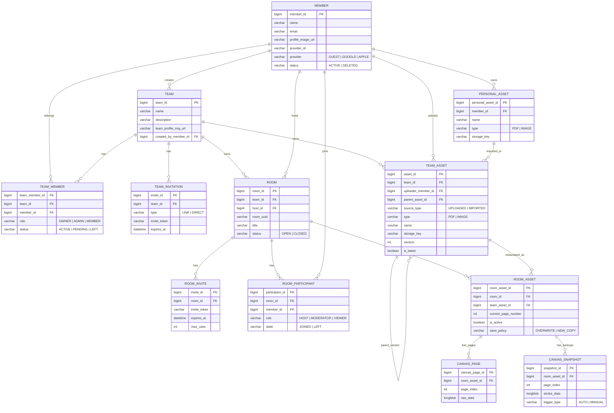

# ChalkChalk Server

> **실시간 협업 화이트보드 플랫폼** — 팀 기반 회의실에서 PDF 문서 위에 실시간 드로잉, 채팅, 음성 통화를 지원하는 백엔드 서버!

<br/>

## 프로젝트 소개

ChalkChalk은 팀 협업을 위한 실시간 화이트보드 플랫폼입니다. 회의실을 생성하고 PDF 문서를 공유하며, 참여자 전원이 동시에 필기하고, 채팅과 음성 통화로 소통할 수 있습니다.

### 핵심 기능

- **실시간 드로잉 동기화** — WebSocket + Redis Pub/Sub 기반, 다수 사용자의 필기 스트로크를 실시간 브로드캐스트
- **팀 & 회의실 관리** — 팀 생성/초대, 역할 기반 권한 관리, 회의실 생성/입장/퇴장
- **문서 기반 화이트보드** — PDF/이미지를 업로드하고 페이지별 필기, 스냅샷 저장/복원
- **실시간 채팅** — STOMP 메시징 + MongoDB 영속 저장, 채팅 히스토리 페이징 조회
- **WebRTC 음성 통화** — 시그널링 서버 역할 (Offer/Answer/ICE Candidate 중계)
- **에셋 버전 관리** — 팀 에셋의 버전 체인, 개인 파일 → 팀 에셋 Import, 스냅샷 복원
- **모니터링 & 로깅** — Prometheus + Grafana 메트릭, Loki 로그 수집

<br/>

## 기술 스택

| 분류 | 기술 |
|------|------|
| **Language** | Java 21 |
| **Framework** | Spring Boot 3.5.10, Spring Security, Spring Data JPA/MongoDB/Redis |
| **Real-Time** | WebSocket (STOMP), Redis Pub/Sub |
| **Database** | MySQL 8.4, MongoDB, Redis |
| **Cloud Storage** | Cloudflare R2 (S3 Compatible) — AWS SDK v2 |
| **Authentication** | JWT (Access + Refresh Token), OAuth2 (Google, Apple) |
| **Monitoring** | Prometheus, Grafana, Loki, Sentry |
| **Infra** | Oracle Cloud Infrastructure, Docker Compose |
| **CI/CD** | GitHub Actions → OCI systemd 배포 |
| **Docs** | Swagger / OpenAPI 3.0 (springdoc) |
| **Build** | Gradle, JUnit 5 |

<br/>

## 시스템 아키텍처

```
┌──────────────────────────────────────────────────────────────────────┐
│                          Client (iOS App)                           │
│                  REST API  /  WebSocket (STOMP)                     │
└──────────┬────────────────────────┬──────────────────────┬──────────┘
           │ HTTP                   │ WS (STOMP)           │ Presigned URL
           ▼                       ▼                      ▼
┌─────────────────┐   ┌───────────────────────┐   ┌──────────────┐
│  Spring Boot    │   │  WebSocket Broker      │   │ Cloudflare   │
│  REST API       │   │  /topic, /queue        │   │ R2 Storage   │
│                 │   │  JWT Auth at Handshake │   │ (S3 Compat)  │
│  - Auth         │   │                        │   └──────────────┘
│  - Team         │   │  ┌── Chat Channel     │
│  - Meeting      │   │  ├── Drawing Channel  │
│  - Asset Mgmt   │   │  ├── Voice Channel    │
│  - Personal     │   │  └── Follow Channel   │
└────────┬────────┘   └───────────┬───────────┘
         │                        │
         ▼                        ▼
┌─────────────────────────────────────────────────────────────────────┐
│                         Redis Pub/Sub                               │
│  chat:room:{uuid}  |  drawing:room:{uuid}  |  voice:room:{uuid}   │
│                     follow:room:{uuid}                              │
└────────┬───────────────────────┬───────────────────────┬────────────┘
         │                       │                       │
         ▼                       ▼                       ▼
┌──────────────┐   ┌──────────────────┐   ┌──────────────────────────┐
│   MySQL 8.4  │   │    MongoDB       │   │    Prometheus + Grafana  │
│              │   │                  │   │    + Loki                │
│ - Member     │   │ - ChatMessage    │   │                          │
│ - Team       │   │ - DrawingSnapshot│   │  Exporters:              │
│ - Room       │   │                  │   │  - Spring Actuator       │
│ - Asset      │   │                  │   │  - mysqld-exporter       │
│ - Canvas     │   │                  │   │  - redis-exporter        │
│              │   │                  │   │  - mongodb-exporter      │
└──────────────┘   └──────────────────┘   └──────────────────────────┘
```

<br/>

## 멀티 데이터베이스 전략

| DB | 용도 | 선택 이유 |
|----|------|-----------|
| **MySQL** | Member, Team, Room, Asset, Canvas 등 관계형 데이터 | 트랜잭션 무결성, 복잡한 조인 쿼리 |
| **MongoDB** | 채팅 메시지, 드로잉 스냅샷 | 대량 쓰기 성능, 유연한 스키마, 타임스탬프 기반 페이징 |
| **Redis** | 실시간 메시지 Pub/Sub, 드로잉 스트로크 버퍼, 초대 토큰 캐싱 | 초저지연 메시지 브로드캐스트, TTL 기반 자동 만료 |

<br/>

## 도메인 설계 (DDD)

도메인 주도 설계 기반의 Vertical Slicing 아키텍처를 적용했습니다. 각 도메인은 독립적인 Entity, Repository, Service, Controller, DTO, Exception을 가집니다.

```
src/main/java/com/writingboard/server/
├── domain/
│   ├── auth/           # JWT 인증, 게스트/소셜 로그인, 토큰 갱신
│   ├── member/         # 회원 프로필 관리, 탈퇴
│   ├── team/           # 팀 CRUD, 멤버 관리, 초대(링크/다이렉트), 에셋 버전 관리
│   ├── personal/       # 개인 파일(PDF/이미지) 관리
│   ├── meeting/        # 회의실 생성/입퇴장, 에셋 로드, 캔버스, 참여자 팔로우
│   ├── chat/           # 실시간 채팅, 채팅 히스토리
│   ├── drawing/        # 실시간 드로잉 동기화, 스트로크 버퍼링, 스냅샷
│   └── voice/          # WebRTC 시그널링 (Offer/Answer/ICE)
└── global/
    ├── config/         # Security, WebSocket, Redis Pub/Sub, OpenAPI
    ├── exception/      # GlobalExceptionHandler
    ├── storage/        # Cloudflare R2 연동 (Presigned URL, 파일 업/다운로드)
    ├── websocket/      # JWT Handshake, STOMP 인터셉터
    └── common/         # BaseEntity, ErrorResponse
```

<br/>

## ERD



<br/>

## API 명세

### Auth
| Method | Endpoint | 설명 |
|--------|----------|------|
| POST | `/api/auth/guest-login` | 디바이스 기반 게스트 로그인 |
| POST | `/api/auth/social-login` | 소셜 로그인 (Google/Apple idToken) |
| POST | `/api/auth/refresh` | Access Token 갱신 |

### Member
| Method | Endpoint | 설명 |
|--------|----------|------|
| GET | `/api/members/me` | 내 프로필 조회 |
| PATCH | `/api/members/me` | 프로필 수정 (이름, 이미지) |
| DELETE | `/api/members/me` | 회원 탈퇴 |

### Team
| Method | Endpoint | 설명 |
|--------|----------|------|
| POST | `/api/teams` | 팀 생성 |
| GET | `/api/teams` | 내 팀 목록 조회 |
| GET | `/api/teams/{teamId}` | 팀 상세 조회 |
| PATCH | `/api/teams/{teamId}` | 팀 정보 수정 |
| DELETE | `/api/teams/{teamId}` | 팀 삭제 (Owner만) |
| GET | `/api/teams/{teamId}/members` | 팀 멤버 목록 |
| PATCH | `/api/teams/{teamId}/members/{id}/role` | 멤버 역할 변경 |
| DELETE | `/api/teams/{teamId}/members/{id}` | 멤버 추방 |
| POST | `/api/teams/{teamId}/invitations/link` | 초대 링크 생성 |
| POST | `/api/teams/{teamId}/invitations/direct` | 다이렉트 초대 |

### Team Asset
| Method | Endpoint | 설명 |
|--------|----------|------|
| POST | `/api/teams/{teamId}/assets` | 에셋 등록 |
| GET | `/api/teams/{teamId}/assets` | 에셋 목록 (페이징) |
| GET | `/api/teams/{teamId}/assets/{id}` | 에셋 상세 |
| GET | `/api/teams/{teamId}/assets/{id}/versions` | 버전 히스토리 |
| POST | `/api/teams/{teamId}/assets/{id}/versions` | 새 버전 생성 |
| GET | `/api/teams/{teamId}/assets/{id}/note-data` | PDF + 드로잉 데이터 조회 |
| POST | `/api/teams/{teamId}/assets/{id}/drawing-data` | 드로잉 데이터 저장 |

### Personal Asset
| Method | Endpoint | 설명 |
|--------|----------|------|
| POST | `/api/personal-assets` | 개인 파일 등록 |
| GET | `/api/personal-assets` | 개인 파일 목록 (페이징) |
| GET | `/api/personal-assets/{id}` | 개인 파일 상세 |
| DELETE | `/api/personal-assets/{id}` | 개인 파일 삭제 |

### Meeting Room
| Method | Endpoint | 설명 |
|--------|----------|------|
| POST | `/api/rooms` | 회의실 생성 |
| GET | `/api/rooms/{uuid}` | 회의실 상세 조회 |
| DELETE | `/api/rooms/{uuid}` | 회의실 종료 (Host만) |
| GET | `/api/rooms/me` | 참여 중인 회의실 목록 |
| GET | `/api/rooms/hosted` | 호스트 회의실 히스토리 |
| GET | `/api/rooms/team/{teamId}` | 팀 회의실 목록 |
| POST | `/api/rooms/{uuid}/join` | 회의실 입장 |
| POST | `/api/rooms/join/invite/{token}` | 초대 링크로 입장 |
| POST | `/api/rooms/{uuid}/leave` | 회의실 퇴장 |
| POST | `/api/rooms/{uuid}/kick/{memberId}` | 참여자 강제 퇴장 |
| POST | `/api/rooms/{uuid}/invites/link` | 초대 링크 생성 |

### Room Asset
| Method | Endpoint | 설명 |
|--------|----------|------|
| POST | `/api/rooms/{uuid}/assets/team` | 팀 에셋 로드 |
| POST | `/api/rooms/{uuid}/assets/personal` | 개인 에셋 로드 (팀 에셋으로 복사) |
| GET | `/api/rooms/{uuid}/assets` | 회의실 에셋 목록 |
| POST | `/api/rooms/{uuid}/assets/{id}/activate` | 에셋 활성화 |
| POST | `/api/rooms/{uuid}/assets/{id}/save` | 에셋 저장 (덮어쓰기/새 복사본) |
| POST | `/api/rooms/{uuid}/assets/{id}/page` | 페이지 전환 |

### Drawing (REST)
| Method | Endpoint | 설명 |
|--------|----------|------|
| GET | `/api/rooms/{uuid}/assets/{id}/strokes` | 스트로크 히스토리 조회 |
| POST | `/api/rooms/{uuid}/assets/{id}/snapshots` | 드로잉 스냅샷 생성 |
| GET | `/api/rooms/{uuid}/assets/{id}/snapshots/latest` | 최신 스냅샷 조회 |

### Chat (REST)
| Method | Endpoint | 설명 |
|--------|----------|------|
| GET | `/api/rooms/{uuid}/messages` | 채팅 히스토리 조회 (커서 기반 페이징) |

<br/>

## WebSocket 엔드포인트

STOMP over WebSocket, JWT 인증 기반의 실시간 통신을 지원합니다.

**연결**: `ws://host/ws-stomp?token={JWT}`

| 기능 | Send (Client → Server) | Subscribe (Server → Client) |
|------|------------------------|-----------------------------|
| **채팅** | `/app/room/{uuid}/chat` | `/topic/room/{uuid}` |
| **드로잉** | `/app/room/{uuid}/asset/{assetId}/drawing` | `/topic/room/{uuid}/drawing` |
| **음성** | `/app/room/{uuid}/voice` | `/topic/room/{uuid}/voice` |
| **팔로우** | REST API 기반 | `/topic/room/{uuid}/follow` |
| **에러** | — | `/user/queue/errors` |

### WebSocket 인증 흐름

```
Client                    Server
  │                         │
  │  CONNECT ws://...       │
  │  ?token={JWT}           │
  │ ───────────────────────>│
  │                         │  JwtHandshakeInterceptor: JWT 검증
  │                         │  StompChannelInterceptor: CONNECT 인가
  │  CONNECTED              │
  │ <───────────────────────│
  │                         │
  │  SUBSCRIBE              │
  │  /topic/room/{uuid}     │
  │ ───────────────────────>│  StompChannelInterceptor: 참여자 검증
  │                         │  (RoomParticipant.state == JOINED)
  │  SUBSCRIBED             │
  │ <───────────────────────│
  │                         │
  │  SEND /app/room/        │
  │  {uuid}/chat            │
  │ ───────────────────────>│  ChatService → Redis Pub
  │                         │  Redis Sub → STOMP Broadcast
  │  MESSAGE                │
  │  /topic/room/{uuid}     │
  │ <───────────────────────│
```

<br/>

## 실시간 드로잉 동기화 설계

Redis를 활용한 스트로크 버퍼링 + 버전 관리 + Pub/Sub 브로드캐스트 구조입니다.

```
┌────────────┐   WebSocket    ┌──────────────────────────────────────┐
│  Client A  │ ──────────────>│  DrawingService                      │
│  (stroke)  │                │                                      │
└────────────┘                │  1. 요청 검증 (Room, Asset, 참여자)  │
                              │  2. Redis INCR → 버전 할당           │
                              │  3. Redis LIST → 스트로크 버퍼링     │
                              │  4. Redis PUB → 브로드캐스트         │
                              └──────────┬───────────────────────────┘
                                         │
                                         ▼
                              ┌──────────────────────┐
                              │       Redis          │
                              │                      │
                              │  drawing:version:... │  ← INCR 카운터
                              │  drawing:buffer:...  │  ← 스트로크 LIST
                              │  drawing:room:{uuid} │  ← Pub/Sub 채널
                              └──────────┬───────────┘
                                         │ Subscribe
                                         ▼
                              ┌──────────────────────┐
                              │  DrawingRedis        │
                              │  Subscriber          │
                              │                      │
                              │  → /topic/room/      │
                              │    {uuid}/drawing    │──────> Client B, C, ...
                              └──────────────────────┘

스냅샷 저장: Client → REST API → DrawingSnapshotService → MongoDB (DrawingSnapshot)
```

**Redis Key 패턴:**
- `drawing:version:room:{uuid}:asset:{assetId}:page:{pageIndex}` — 스트로크 순서 보장
- `drawing:buffer:room:{uuid}:asset:{assetId}:page:{pageIndex}` — 스트로크 히스토리 (TTL: 3시간)

<br/>

## 인증 & 보안

### JWT 이중 토큰 구조

```
Guest Login                           Social Login
    │                                      │
    │  deviceId + name                     │  provider + idToken
    ▼                                      ▼
┌──────────────┐                  ┌──────────────────────┐
│ AuthService  │                  │ SocialTokenVerifier   │
│              │                  │ (Google/Apple 검증)   │
│ Member 조회  │                  │                       │
│ 또는 생성    │                  │ → SocialUserInfo 추출 │
└──────┬───────┘                  └──────────┬────────────┘
       │                                     │
       └─────────────┬───────────────────────┘
                     ▼
            ┌──────────────────┐
            │    JwtProvider   │
            │                  │
            │  Access Token    │  HMAC-SHA256, 2시간
            │  Refresh Token   │  HMAC-SHA256, 7일
            └──────────────────┘
```

### 보안 적용 사항
- **XSS 방지**: 채팅 메시지 `HtmlUtils.htmlEscape()` 처리
- **비밀번호 암호화**: 회의실 비밀번호 `BCryptPasswordEncoder` 적용
- **JWT 다중 계층 검증**: HTTP Filter + WebSocket Handshake + STOMP Interceptor
- **역할 기반 접근 제어**: Team (OWNER/ADMIN/MEMBER), Room (HOST/MODERATOR/VIEWER)
- **CORS 정책**: 운영 환경 화이트리스트 기반 설정
- **Soft Delete**: 회원 탈퇴, 에셋 삭제 시 데이터 보존

<br/>

## 인프라 & 모니터링

### Docker Compose 서비스 구성

```yaml
# 총 8개 컨테이너
db:                 MySQL 8.4           # 관계형 데이터 저장
redis:              Redis Alpine        # Pub/Sub + 캐싱
mongo:              MongoDB             # 채팅/드로잉 문서 저장
mysqld-exporter:    Prometheus Exporter # MySQL 메트릭 수집
redis-exporter:     Prometheus Exporter # Redis 메트릭 수집
mongodb-exporter:   Prometheus Exporter # MongoDB 메트릭 수집
prometheus:         Prometheus          # 메트릭 수집/저장 (15일 보관)
grafana:            Grafana             # 대시보드 시각화
```

### 모니터링 파이프라인

```
Spring Boot                    Prometheus            Grafana
  │ /actuator/prometheus  ───>  scrape (15s) ───>   Dashboard
  │
MySQL ──> mysqld-exporter ───>  scrape (15s) ───>   Dashboard
Redis ──> redis-exporter  ───>  scrape (15s) ───>   Dashboard
Mongo ──> mongodb-exporter ──>  scrape (15s) ───>   Dashboard

Spring Boot                    Loki
  │ logback-spring.xml    ───> Push (Loki4j) ───>   Grafana Log Explorer
```

### CI/CD 파이프라인

```
GitHub (develop branch)
    │  push
    ▼
GitHub Actions
    │
    ├── 1. Checkout & JDK 21 Setup
    ├── 2. Gradle Build (test skip)
    ├── 3. SSH → OCI: Stop service, Backup JAR, Generate .env
    ├── 4. SCP → OCI: Upload JAR to /opt/writing-board/
    ├── 5. SSH → OCI: systemctl start writing-board
    └── 6. Health Check: curl /actuator/health
```

<br/>

## 프로젝트 구조

```
chalkchalk-server/
├── .github/workflows/
│   └── deploy.yml                # GitHub Actions CI/CD 파이프라인
├── prometheus/
│   └── prometheus.yml            # Prometheus scrape 설정
├── src/main/
│   ├── java/com/writingboard/server/
│   │   ├── domain/
│   │   │   ├── auth/             # 인증 (JWT, 게스트/소셜 로그인)
│   │   │   ├── member/           # 회원 관리
│   │   │   ├── team/             # 팀 (멤버, 초대, 에셋)
│   │   │   ├── personal/         # 개인 파일 관리
│   │   │   ├── meeting/          # 회의실 (Room, Asset, Canvas, Invite)
│   │   │   ├── chat/             # 실시간 채팅
│   │   │   ├── drawing/          # 실시간 드로잉
│   │   │   └── voice/            # 음성 통화 시그널링
│   │   └── global/
│   │       ├── config/           # Security, WebSocket, Redis, OpenAPI
│   │       ├── exception/        # 전역 예외 처리
│   │       ├── storage/          # Cloudflare R2 스토리지
│   │       ├── websocket/        # JWT 인터셉터
│   │       └── common/           # BaseEntity, ErrorResponse
│   └── resources/
│       ├── application.yml
│       ├── application-dev.yml
│       ├── application-prod.yml
│       └── logback-spring.xml    # Loki 로그 수집 설정
├── docker-compose.yml            # 8개 서비스 (DB + Monitoring)
├── build.gradle
└── erd.mermaid                   # ERD 다이어그램 원본
```

<br/>

## 로컬 개발 환경 설정

### 사전 요구사항
- Java 21
- Docker & Docker Compose

### 실행 방법

```bash
# 1. 환경변수 설정
cp .env.example .env
# .env 파일을 열어 JWT_SECRET, R2 관련 값을 채워주세요

# 2. 인프라 서비스 실행 (MySQL, Redis, MongoDB, Monitoring)
docker-compose up -d

# 3. 애플리케이션 빌드
./gradlew build

# 4. 애플리케이션 실행
./gradlew bootRun
```

### 접속 정보

| 서비스 | URL | 비고 |
|--------|-----|------|
| API Server | `http://localhost:8080` | Spring Boot |
| Swagger UI | `http://localhost:8080/swagger-ui/index.html` | API 문서 |
| WebSocket | `ws://localhost:8080/ws-stomp` | STOMP Endpoint |
| Grafana | `http://localhost:3000` | 모니터링 대시보드 |
| Prometheus | `http://localhost:9090` | 메트릭 조회 |

<br/>

## 에러 처리

도메인별 커스텀 예외 + 전역 핸들러 패턴을 적용했습니다.

```java
// 도메인 예외 발생
throw new TeamException(TeamErrorCode.TEAM_NOT_FOUND);

// GlobalExceptionHandler → 구조화된 응답 반환
{
  "code": "TEAM_001",
  "message": "팀을 찾을 수 없습니다."
}
```

| 도메인 | Exception | ErrorCode |
|--------|-----------|-----------|
| Auth | `AuthException` | `AuthErrorCode` |
| Member | `MemberException` | `MemberErrorCode` |
| Team | `TeamException` | `TeamErrorCode` |
| Meeting | `MeetingException` | `MeetingErrorCode` |
| Chat | `ChatException` | `ChatErrorCode` |
| Drawing | `DrawingException` | `DrawingErrorCode` |
| Voice | `VoiceException` | `VoiceErrorCode` |
| Personal | `PersonalException` | `PersonalErrorCode` |
